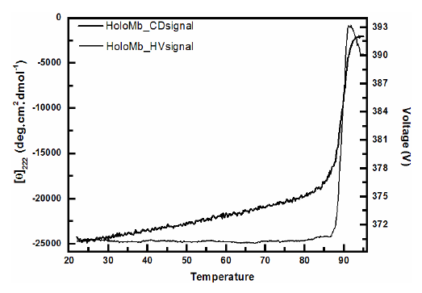

**What is Protein Aggregation?**

Protein aggregation is a common issue encountered during manufacture of biotherapeutics. Aggregation is a general term that encompasses several types of interactions or characteristics. Aggregates of proteins may arise from several mechanisms and may be classified in numerous ways, including soluble/insoluble, covalent/noncovalent, reversible/irreversible, and native/denatured. There is no consistent definition of what is meant by a “soluble” aggregate, so working definitions are often employed. Soluble aggregates refer to those that are not visible as discrete particles and that may not be removed by a filter with a pore size of 0.22 μm. Conversely, insoluble aggregates may be removed by filtration and are often visible to the unaided eye. However, the levels of soluble aggregates such as dimers and trimers that are acceptable are not well defined. Covalent aggregates arise from the formation of a chemical bond between 2 or more monomers. Disulfide bond formation resulting from previously unpaired free thiols is a common mechanism for covalent aggregation. Oxidation of tyrosines may also result in covalent aggregation through the formation of bi-tyrosine. For some proteins, a covalent interaction between monomers is required to form a stable protein structure. Reversible protein aggregation typically results from relatively weak noncovalent protein interactions. The reversibility is sometimes indicative of the presence of equilibrium between the monomer and higher order forms. This equilibrium may shift as a result of a change in solution conditions such as a decrease in protein concentration or a change in pH. A weak, reversible self-association of this type has been observed in a monoclonal antibody to VEGF. On occasion, reversible protein self-association manifests itself as an increase in viscosity.

The effect of the presence of self-associated species is not always known. Both the thermodynamics and the kinetics of the system may assist in understanding how to control the association of the protein. In addition, this knowledge aids in determining how serious the presence of associated species may be during the development of a protein therapeutic. Both the potential for increased exposure to the associated species and the route of administration present potential safety concerns.

Historically, investigators believed that denaturation was a prerequisite for protein aggregation. Exposure of hydrophobic surfaces upon denaturation results in favorable protein: protein interactions in aqueous solutions. It is true that this type of interaction leads to the formation of aggregates in many proteins and may cause extreme precipitation. However, the role of native protein interactions in the formation of self-associated species has recently become more appreciated. Small perturbations in protein structure may expose hydrophobic surfaces that lead to aggregation. Electrostatic interactions have been implicated in the formation of self-associated species of a monoclonal antibody, while dipole-dipole interactions are believed to be the cause of fibrillogenic association of β-sheets.

Just as there are many types of interactions that can lead to protein aggregation, there are many environmental factors that can lead to aggregation. Solution conditions such as temperature, protein concentration, pH, and the ionic strength may affect the amount of aggregate observed. The presence of certain ligands, including specific ions, may enhance aggregation. Stresses to the protein such as freezing, exposure to air, or interactions with metal surfaces may result in surface denaturation, which then leads to the formation of aggregates. Finally, mechanical stresses may cause protein aggregation. Each of these environmental factors is typically encountered during bioprocessing.

**How CD technique can help in measuring Aggregation:**

Circular dichroism spectroscopy is widely used to follow the stability of a protein by increasing denaturant conditions. The most common denaturants are temperature, chemicals (usually urea and guanidinium chloride) and extremes of pH (usually acidic). As the denaturant condition increases the stability of the protein decreases and then unfolds (Ramos and Ferreira, 2005). CD is a convenient technique to follow protein unfolding because the spectra of folded and random coil are quite different.

CD spectrum of different secondary structures of a protein.

Ref: The above figure has been taken from Figure 2 of the paper titled "The use of circular dichroism spectroscopy to study protein folding, form and function" by Daniel H. A. Corrêa and Carlos H. I. Ramos published in African Journal of Biochemistry Research Vol.3 (5), pp. 164-173, May, 2009

Characteristic far-UV CD spectra for an all-α-helix, an all-β-sheet and a random coil protein. The spectrum for an all-α-helix protein (Alpha) has two negative bands of similar magnitude at 222 and 208 nm, and a positive band at ~ 190 nm. The spectrum for an all β- sheet protein (Beta) has in general a negative band between 210-220 nm and a positive band between 195 - 200 nm. The spectrum for a disorderly (random) protein has a negative band of great magnitude at around 200 nm.

The indication of absorption of light is given by the dynode voltage module (in volts, V), which measures the response of the photomultiplier during the measurement and is an indicator of the quantity of photons that are not absorbed or are scattered by the sample. The higher the amount recorded, the greater the absorption or the scattering. A high absorption causes an increase in noise and consequently increases the errors of elipticity measurement. In general, the acceptable limit for reliable reading is 600 V, but acquisitions of up to 700 V are acceptable provided that the number of spectra collection and accumulation is highly enough to reduce the noise generated by absorption. It is advisable not to perform readings with voltage above 700 V as this may cause damage to the unit. The use of cells with thinner pathlengths decreases the number of photons that the sample is able to absorb. By using the Beer-Lambert law one can vary the concentration of sample and the length of the optical path in order to optimize the measurement.

**From the data of Dynode Voltage how we can infer whether Aggregation has take place or not:-**

The unfolding transition can be easily determined by choosing a wavelength where the difference in signal for folded and unfolded protein is large. For instance, α-helical proteins have a large CD signal at 222 nm in which unfolded proteins has none or little signal. As discussed above the dynode voltage V (high-voltage applied to the photomultiplier of the UV detector to compensate for the reduction in the intensity light) is a result from light absorption or scattering and should be recorded for all CD measurements. For being related to scattering the recorded dynode voltage V can be used to probe the turbidity of the solution and hence aggregation (Benjwal et al., 2006). Accordingly to the Beer-Lambert law a heat induced change in the dynode voltage can only be originated from variations in the light scattering which depends on the particle size. Thus the signal of CD at 222 nm and the dynode voltage V as a function of temperature can be used to determine the amount of aggregation from denaturation. The curve profile shows that the CD signal starts to decrease at about 85ºC followed by a two-state like transition. This transition indicates that the protein unfolds as verified by the decrease in CD signal and aggregates as verified by the increase in the voltage which is related to light scattering. To sum up, as the protein aggregated its size increased and more light was scattered.

**MRE values and Dynode voltage comparison.**

Ref: The above figure has been taken from Figure 6 of the paper titled "The use of circular dichroism spectroscopy to study protein folding, form and function" by Daniel H. A. Corrêa and Carlos H. I. Ramos published in African Journal of Biochemistry Research Vol.3 (5), pp. 164-173, May, 2009

Circular dichroism spectra of HoloMyoglobin (Mb) as a function of temperature. Circular dichroism measurements were recorded using a Jasco J-810 spectropolarimeter with 10 mm pathlength cell following the signal at 222 nm and the dynode voltage V as a function of temperature. A heat-induced change in the dynode voltage is originated from variations in the light scattering which depends on the particle size and thus from aggregation. The transitions indicate that the protein unfolds as verified by the decrease in CD signal and aggregates as verified by the increase in the voltage which is related to light scattering. A non-aggregated protein would have shown a constant dynode voltage throughout the whole scan.

